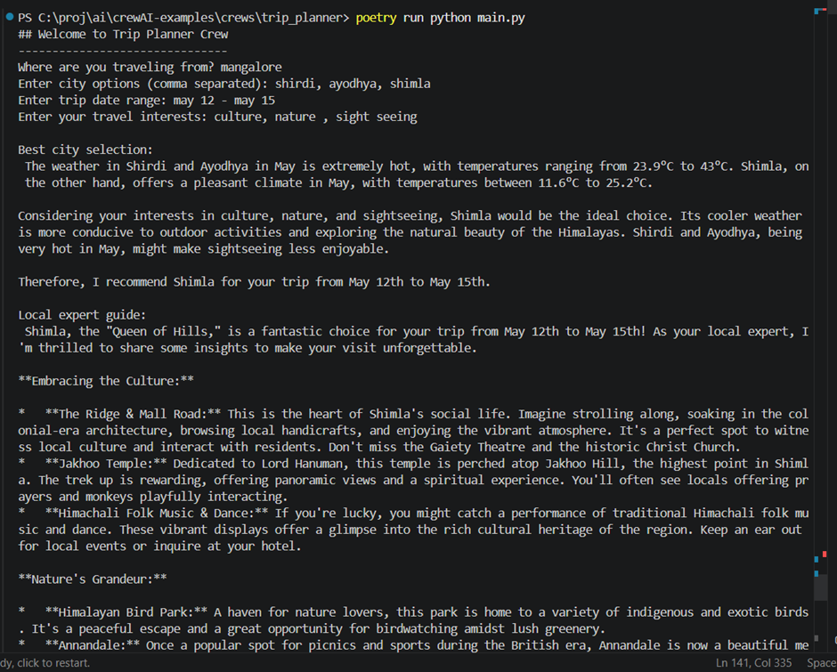
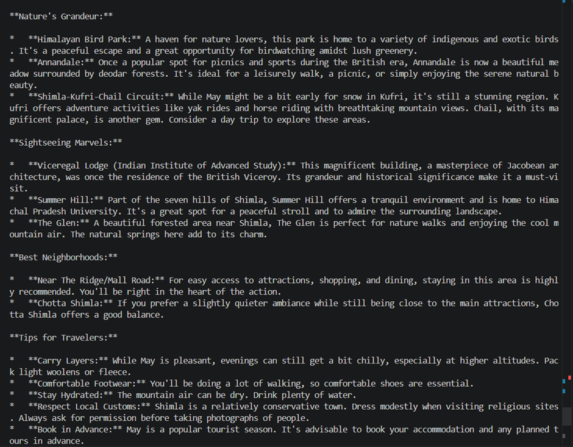
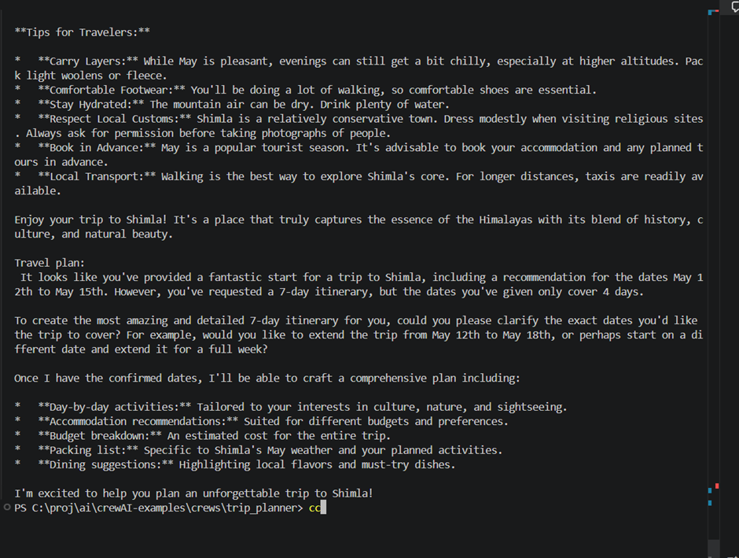

# Trip Planner with LangChain & Gemini

AI-powered trip planning tool that helps you choose the best destination and create an itinerary using multiple specialized AI agents.

## Requirements
- Python 3.10+
- Poetry package manager
- Google Gemini API key (use APIKEY of your prefered model provider, refer https://docs.langchain.com/oss/python/langchain/models)
- Serper API key (search)
- Browserless API key (web scraping)

## Project Structure

```
trip_planner/
├── main.py                 # Entry point, orchestrates agent workflow
├── trip_agents.py          # Agent definitions and tool implementations
├── pyproject.toml          # Project metadata and dependencies
├── .env.example            # Template for API keys
├── .gitignore              # Git configuration
└── README.md               # This file
```

## Tech Stack

- **LangChain** - Agent orchestration framework
- **Google Gemini 2.5 Flash Lite** - LLM powering the agents
- **Serper API** - Internet search capability
- **Browserless API** - Website scraping capability
- **Poetry** - Python dependency management

## Setup Instructions

### 1. Install Dependencies
```bash
poetry install --no-root
```

### 2. Configure API Keys
Copy `.env.example` to `.env` and add your API keys:
```bash
cp .env.example .env
```

Get free API keys from:
- [Google Gemini API](https://aistudio.google.com/app/apikey)
- [Serper Search API](https://serper.dev/) (free tier available)
- [Browserless API](https://www.browserless.io/) (free tier available)

### 3. Run the App
```bash
poetry run python main.py
```

## Quick Start

Then answer these prompts:
- **Where are you traveling from?** → `Mangalore`
- **Enter city options (comma separated):** → `Shirdi, Ayodhya, Shimla`
- **Enter trip date range:** → `July 10 - July 20`
- **Enter your travel interests:** → `temples, nature, culture`

## How It Works

The app has **3 AI Agents** that work together:

1. **City Selection Agent** 🏙️
   - Reviews weather, prices, and attractions for each city
   - Recommends the BEST city based on your interests
   - Example: "Shirdi is best for temples in July"
   - **Tools:** Search Internet(picks the top 4 websites in the search and gathers title, link and snippet, this is done through serpapi), Scrape Websites(uses browserless api to scrape). If required info is already found with 'search internet' tool then the AI sees no need in using the other tool provided to it. It uses it as per need.

2. **Local Expert Agent** 🗺️
   - Provides insider tips about the selected city(here it is shirdi)
   - Shares info about attractions, customs, best neighborhoods
   - Example: "Visit Shirdi's temples in early morning, then explore local markets"
   - **Tools:** Search Internet, Scrape Websites

3. **Travel Concierge Agent** 📋
   - Creates a detailed day-by-day itinerary
   - Includes activities, hotels, budget, packing tips, food recommendations
   - Example: "Day 1: Arrive in Shirdi → Visit temples → Local dinner. Budget: $50/day"
   - **Tools:** Search Internet, Scrape Websites, Calculator






## Key Features

✅ **Multi-Agent Architecture** - Three specialized agents working together
✅ **Tool Integration** - Search and web scraping capabilities
✅ **Smart Context Passing** - Agents share clean context (no tool noise)
✅ **Flexible Date Handling** - Assumes current year if not specified
✅ **Real-time Web Data** - Fetches current weather, prices, attraction info


